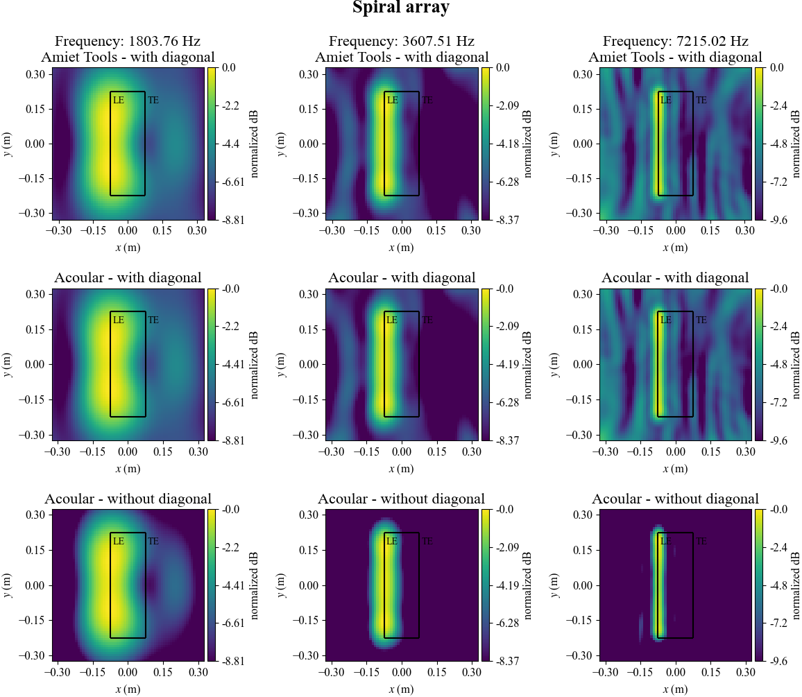

<p align="left">
  <a href="https://github.com/eac-ufsm/augen/" target="_blank">
    
  </a>

  <a href="https://www.python.org/downloads/release/python-3810/" target="_blank">
    
  </a>

  <a href="https://github.com/eac-ufsm/augen/commits/master" target="_blank">
    
  </a>

  <a href="https://github.com/psf/black" target="_blank">
    
  </a>

</p>

*This is the Brazilian Portuguese version of this documentation file. For the English version of this text [click here](README.md).*

# Augen (versão: 0.1.1)

Augen é uma *toolbox* (conjunto de ferramentas) projetada para criar uma integração direta entre as *toolboxes* [Acoular](https://github.com/acoular/acoular) [[1]](#1) e [Amiet Tools](https://github.com/fchirono/amiet_tools) [[2]](#2). A ferramenta fornece ainda algumas funções escritas em Matlab para fornecer suporte à *toolboxes* como [ITA-Toolbox](https://git.rwth-aachen.de/ita/toolbox) [[3]](#3) e [Beamap](https://github.com/eac-ufsm/beamap) [[4]](#4).

O nome **Augen** é um acrônimo para "**A**miet-Aco**u**lar Inte**g**ration Modul**e** in Pytho**n**".

**O artigo que apresenta a *toolbox* está disponível no [ResearchGate](https://www.researchgate.net/publication/363031873_Integracao_de_multiplas_toolboxes_para_aplicacao_em_beamforming_e_aeroacustica):**

- *Integração de múltiplas toolboxes para aplicação em beamforming e aeroacústica*

## Instalação

**Nota:** Se você usa o GitHub Desktop você também terá que realizar o procedimento abaixo.

### Procedimento

1. Instale o Python 3.8.10 e o [git](https://git-scm.com/) para proceder com o procedimento de instalação do pacote.

2. Após instalar-se todas a dependências listadas na seção seguinte, pode-se realizar a instalação do Augen. A instalação pode ser feita ao rodar o seguinte comando utilizando o PIP:
```pip install git+https://github.com/eac-ufsm/augen```

**Aviso**: Como o **Amiet Tools** ainda não está disponível no [PyPI](https://pypi.org/), tenha a certeza de executar o seguinte comando antes de instalar o **Augen**:

```pip install git+https://github.com/fchirono/amiet_tools```

## Lista de dependências

Todas as dependências listadas abaixo são necessárias para o funcionamento correto da ferramenta:

- **[Python](https://www.python.org/downloads/release/python-3810/) == 3.8.10**
- [SciPy](https://scipy.org/) == 1.7.1
- [NumPy](https://numpy.org/) == 1.20.3
- [Amiet Tools](https://github.com/fchirono/amiet_tools) == 0.0.2
- [Acoular](https://github.com/acoular/acoular) == 21.5
  - [scikit-learn](https://scikit-learn.org/stable/) (a.k.a. sklearn) == 0.24.2
  - [Numba](https://numba.pydata.org/) == 0.54.0
  - [six](https://github.com/benjaminp/six) == 1.0.4
  - [pytables](https://github.com/PyTables/PyTables) (a.k.a. tables) == 3.6.1
  - [Traits](https://docs.enthought.com/traits/index.html) == 6.2.0
  - [TraitsUI](https://docs.enthought.com/traitsui/) == 7.2.1
  - libpython

### Como instalar um versão antiga de uma depedência

Para realizar a instalação de um pacote/módulo em Python utilizando o PIP basta utilizar o seguinte comando:

```pip install pacote_exemplo```.

Contudo o PIP irá instalar a última versão disponível. Para contornar tal caso, utiliza-se o comando abaixo a fim de especificar-se uma determinada versão:

```pip install pacote_exemplo==x.x.x```,

no qual **x.x.x** é versão a ser determinada, um exemplo seria quando **x.x.x** assume **1.7.1**.

## Tutorial

A pasta [*examples*](examples) traz códigos que buscam exemplificar a utilização da *toolbox*, em que os códigos estão regidos com uma série de comentários em inglês.

### Resultados obtidos para o exemplo do arranjo de microfones em espiral



## Notas importantes

- A pasta [*tests*](simple_tests) traz uma série de códigos simples para testar diferentes classes e funções disponibilizadas pela ferramenta. Essa pasta não é uma pasta para testagens *pythoanianas* oficiais.

- A [Matlab](matlab) detêm de algumas funções escritas em Matlab para serem utilizadas em conjunto com *toolboxes* como ITA-Toolbox e Beamap — voltadas para ler/salvar arquivos em formato XML, das geometrias dos arranjos de microfones.

## Sobre os autores

**[Michael Markus Ackermann](https://www.researchgate.net/profile/Michael-Ackermann-3)** é estudante do curso de Engenharia Acústica da Universidade Federal de Santa Maria (UFSM). Augen é originalmente criado por Michael como parte de seu trabalho de conclusão de curso (TCC) e é focado em aeroacústica e imageamento acústico (*acoustical beamforming*) — a *toolbox* é uma vertente do Beamap, feito em Python.

**[William D'Andrea Fonseca](https://www.researchgate.net/profile/William-Fonseca-4)** é Professor do curso de graduação em Engenharia Acústica (orientando projetos de mestrado e graduação) na Universidade Federal de Santa Maria (UFSM). William realiza pesquisas em Engenharia Acústica, Engenharia Elétrica e Engenharia Aeroespacial. Seus projetos atuais incluem: *Beamforming*, Instrumentação, Processamento de Sinais e Educação em Acústica, Áudio e Vibração (mais detalhes na sua página do [ResearchGate](http://will.eng.br)).

## Nos cite

Ackermann, Michael Markus; Fonseca, William D'Andrea; Mareze, Paulo Henrique; Casagrande Hirono, Fábio. *Integracão de múltiplas toolboxes para aplicação em beamforming e aeroacústica.* Em XII Congresso Iberoamericano de Acústica (FIA 2020/22) & XXIX Encontro da Sociedade Brasileira de Acústica - SOBRAC. Florianópolis, SC, Brazil, 2022. URL: <https://bit.ly/fia2022-augen>.

**BibTex**:

```bibtex
@article{augen-2022,
author = {Ackermann, Michael Markus and Fonseca, William {\relax D'A}ndrea, and Mareze, Paulo Henrique and Casagrande Hirono, Fábio},
title = {Integracão de múltiplas toolboxes para aplicação em beamforming e aeroacústica},
booktitle = {XII Congresso Iberoamericano de Acústica \& XXIX Encontro da Sociedade Brasileira de Acústica - SOBRAC},
date = {2022},
address = {Florianópolis, SC, Brazil},
url = {https://bit.ly/fia2022-augen}
}
```

## Referências

<a id="1">[1]</a> Sarradj, Ennes e Herold, Gert. *A Python framework for microphone array data processing (Acoular - Acoustic Testing and Source Mapping Software).* Applied Acoustics, 116:50–58, 2017. ISSN 0003-682X. doi: [10.1016/j.apacoust.2016.09.015.](https://doi.org/10.1016/j.apacoust.2016.09.015.) *Toolbox* disponível em: <http://acoular.org>.

<a id="2">[2]</a> Casagrande Hirono, Fabio; Joseph, Phillip e Fazi, Filippo M. *An Open–Source Implementation of Analytical Turbulence–Airfoil Interaction Noise Model*. Em AIAA Aviation 2020 Forum, número AIAA 2020-2544, págs. 1–21. American Institute of Aeronautics and Astronautics, 2020. doi: [10.2514/6.2020-2544](https://doi.org/10.2514/6.2020-2544). *Toolbox* disponível em: <https://github.com/fchirono/amiet_tools>.

<a id="3">[3]</a>Dietrich, Pascal; Guski, Martin; Pollow, Martin; Müller-Trapet, Markus; Masiero, Bruno; Scharrer, Ro man e Vorlaender, Michael. *ITA-Toolbox – An Open Source Matlab Toolbox for Acousticians*. Em 38th German Annual Conference on Acoustics (DAGA), número 38, págs. 151–152, Darmstadt, Germany, 2012. Disponível em: <https://pub.dega-akustik.de/DAGA_2012/data/articles/000164.pdf>. *Toolbox* disponível em: <https://git.rwth-aachen.de/ita/toolbox>.

<a id="4">[4]</a> Fonseca, William D’Andrea; Mareze, Paulo H.; Mello, Felipe R. e Fonseca, Carlos Calixto. Teaching Acoustical Beamforming via Active Learning Approach. Em 9th Berlin Beamforming Conference (BeBeC), número BeBeC-2022-D4, Berlim, Alemanha, junho 2022. Disponível em: [BeBeC 2022](https://bit.ly/bebec2022).
